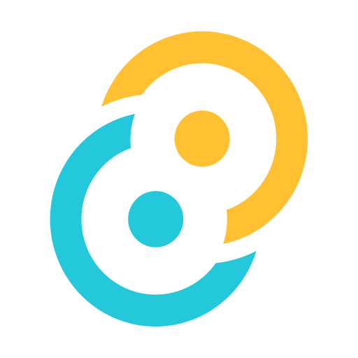
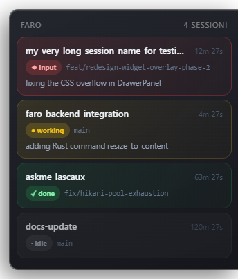
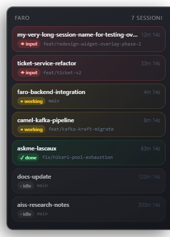

<div align="center">



# Faro

### A lighthouse for your Claude Code sessions 🗼

**Faro** is a lightweight, always-on-top desktop overlay that shows the **live status of every Claude Code session** on your machine — so at a single glance you know which one is working, which is done, and which is **waiting for you**.

Running one session, or ten in parallel? Faro is the one place they all stay in view.

<br/>

[](https://github.com/stefff94/faro/releases/latest)
[](https://github.com/stefff94/faro/releases/latest)

[](https://tauri.app)
[](LICENSE)

<br/>

[](https://github.com/stefff94/faro/releases/latest)

<br/>



</div>

---

## Why Faro?

When you run Claude Code across several projects at once, they scatter into separate terminals, tabs, and windows. One is grinding through a refactor. One finished five minutes ago. One has been sitting on a permission prompt — **stuck, waiting on you** — and you have no idea, because it's buried three tabs deep.

Faro fixes that. It sits quietly in the top-right corner of your screen and turns every session into a live, color-coded card:

- 🟡 **See what's running** — every active session, its project, its git branch, and how long it's been in its current state.
- 🔴 **Never miss a prompt** — when a session needs your input, the overlay lights up and *stays* lit until you answer.
- ✅ **Know when it's done** — turns flip to green the moment they complete, so you can pick up the next one without babysitting.
- 🔒 **Stays on your machine** — everything runs on `127.0.0.1`. No account, no telemetry, no cloud. Just a local status light.

No dashboards to open. No commands to remember. Install it, click once, forget it's there — until it tells you something needs you.

---

## See it in action

<div align="center">
<table>
<tr>
<td align="center" valign="top">
<br/>
<sub><b>Standard</b> · full cards with prompt summaries</sub>
</td>
<td align="center" valign="top">
<br/>
<sub><b>Compact</b> · 7+ sessions auto-condense to stay visible</sub>
</td>
</tr>
</table>
</div>

Each card shows the **project name**, **time in current status**, a colored **status chip**, the **git branch**, and (in standard mode) a one-line summary of the **last prompt**. Hover for the full working-directory path; click for a detail panel with quick actions — mute, pin to top, archive.

When a session needs input, the overlay escalates to an unmissable attention state, then decays to a persistent reminder pill until you respond. When idle, it collapses to a tiny count on the screen edge and gets out of your way.

---

## Status at a glance

| Chip | Meaning |
|:----:|---------|
| 🟡 `working` | Claude is processing or running a tool |
| 🔴 `input` | Waiting for a tool-permission prompt — **this one needs you** |
| ⚫ `stale` | Was working, then went quiet past the timeout |
| 🟢 `done` | Turn complete |
| ⚪ `idle` | No recent activity |
| ❌ `error` | Session ended with a failure |

---

## Install

No build tools, no terminal gymnastics. Download, run, click once.

### 🪟 Windows 10/11

1. Grab the **`.msi`** from the [latest release](https://github.com/stefff94/faro/releases/latest) and run it.
2. SmartScreen may warn *"unknown publisher"* — click **More info → Run anyway** (once). Faro isn't code-signed yet; the installer is safe.
3. Make sure **[Git for Windows](https://git-scm.com/download/win)** is installed — Claude Code needs it anyway, and Faro's reporter runs through Git Bash.

### 🍎 macOS 12+

1. Open the **`.dmg`** from the [latest release](https://github.com/stefff94/faro/releases/latest) and drag **Faro** to Applications.
2. First launch: **right-click the app → Open** (it isn't notarized yet).
   Or clear the quarantine flag: `xattr -dr com.apple.quarantine /Applications/Faro.app`

### First run — one click

On first launch Faro shows a single card. Click **`Attiva`** (*Activate*) and it registers its own Claude Code hooks — no config files to edit, no paths to wire up. From then on it lives in the **system tray** (Windows: behind the `∧` overflow) or **menu bar** (macOS), starts at login, and updates itself.

> **That's the whole setup.** Open a Claude Code session and watch it appear.

---

## How it works

Faro is a small [Tauri 2](https://tauri.app) app (Rust core, web UI) with three moving parts:

1. **Hooks** — on activation, Faro registers a set of Claude Code lifecycle hooks that report session events (start, prompt, tool use, stop, end).
2. **Broker** — a tiny local server (`axum` on `127.0.0.1:8765`) collects those events. It binds to loopback only; nothing leaves your machine.
3. **Overlay** — a chromeless, transparent, always-on-top window that reads the broker and renders a card per session, resizing itself to fit.

The only outbound request Faro ever makes is the update check against GitHub Releases. No analytics. No accounts. No data collection.

---

## Updating

Faro checks GitHub Releases on launch and updates itself in the background. You can also trigger a check any time from the tray menu (**Controlla aggiornamenti** — *Check for updates*). Updates are cryptographically signed (minisign), so only genuine releases are ever installed.

---

## Build from source

<details>
<summary>For contributors and maintainers</summary>

<br/>

**Requirements**

- **macOS:** macOS 12+ · [Rust](https://rustup.rs/) 1.70+ · Node.js 20+
- **Windows:** [Rust](https://rustup.rs/) with the MSVC toolchain (`rustup toolchain install stable-x86_64-pc-windows-msvc`) · Visual Studio Build Tools with the *"Desktop development with C++"* workload · Node.js 20+ · Git for Windows

**Run locally**

```bash
npm install
npm run tauri dev
```

The overlay appears top-right; the broker listens on `127.0.0.1:8765`.

**Cut a release**

Bump the version, then push a tag:

```bash
git tag vX.Y.Z && git push --tags
```

CI (GitHub Actions) builds Windows and macOS installers, signs the updater artifacts, and publishes the Release automatically.

</details>

---

## Known limitations

<details>
<summary>The honest fine print</summary>

<br/>

- **Not code-signed yet** — first launch shows a SmartScreen (Windows) / Gatekeeper (macOS) warning; bypass once as described under [Install](#install). Apple notarization and a Windows certificate are on the roadmap.
- **Detects tool-permission prompts only** — not plain-text approval questions or plan-mode confirmations.
- **VS Code extension never reaches `done`** — the Claude Code VS Code extension doesn't fire the `Stop` hook ([#40029](https://github.com/anthropics/claude-code/issues/40029), [#49851](https://github.com/anthropics/claude-code/issues/49851)). Sessions started from the extension's chat panel go `working` → `stale` and never show `done`. Run Claude from the **integrated terminal** (`claude`) for accurate status.
- **Windows needs Git Bash** — the reporter runs via `bash`; without Git for Windows the hooks aren't operative (the tray flags this with *"⚠ Git Bash non trovato"*).
- **Overlay anchor is fixed at startup** — resolution, DPI, or monitor changes need a restart to re-anchor.
- **Port `8765` is hardcoded** — conflict resolution is future work.
- **Windows: all-desktops presence not ported** — the overlay shows on the active virtual desktop only (macOS "all spaces" behavior isn't replicated on Windows yet).

</details>

---

<div align="center">

Built with [Tauri](https://tauri.app), React, and Rust · Licensed under [Apache 2.0](LICENSE)

**[⬇ Download the latest release](https://github.com/stefff94/faro/releases/latest)**

</div>
